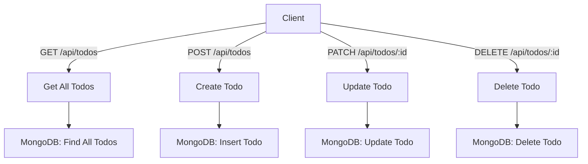

## Go Fiber MongoDB CRUD API

This project is a simple RESTful API for managing Todo items, built using Go, Fiber (v2), and MongoDB. The API allows clients to create, read, update, and delete Todo items.

- **Fiber Framework (v2)**: Fast and minimalist Go web framework inspired by Express.
- **MongoDB**: NoSQL database for managing Todo data.
- **Environment Variables**: Configuration via `.env` file.


#### Prerequisites

- Go 1.23+
- MongoDB instance


#### Installation

1. Clone the repository:
    ```bash
    git clone https://github.com/kmanadkat/golang-rest-api.git
    ```

2. Navigate to the project directory:
    ```bash
    cd golang-rest-api
    ```

3. Install dependencies:
    ```bash
    go mod tidy
    ```

4. Create a `.env` file in the root directory and add your MongoDB URI:
    ```
    MONGODB_URI=mongodb://localhost:27017
    PORT=8081
    ```


#### Running the API

After setting up your environment, run the API server with the following command:

```bash
go run main.go
```
The API will be available at http://localhost:8081


#### API Endpoints




**1. Get all Todos**

- **URL**: `/api/todos`
- **Method**: `GET`
- **Response**: JSON array of all Todo items
- **Status Codes**
  - `200 OK` : Successfully retrieved all Todos


**2. Create a new Todo**

- **URL**: `/api/todos`

- **Method**: `POST`

- **Request Body**

  ```json
  {
    "body": "Walk the dog",
    "completed": false
  }
  ```

- **Response**: The created Todo object
- **Status Codes**:
  - `201 Created` : Successfully created the Todo
  - `400 Bad Request` : Invalid request data


**3. Update a Todo**

- **URL**: `/api/todos/:id`

- **Method**: `PATCH`

- **Request Body**:

  ```json
  {
    "body": "Feed the cat",
    "completed": true
  }
  ```

- **Response**: Updated Todo object

- **Status Codes**:

  - `200 OK` : Successfully updated the Todo
  - `400 Bad Request` : Invalid ID or request data
  - `500 Internal Server Error` : Error while updating


**4. Delete a Todo**

- **URL**: `/api/todos/:id`
- **Method**: `DELETE`
- **Response**: Success message
- **Status Codes**:
  - `200 OK` : Successfully deleted the Todo
  - `400 Bad Request` : Invalid ID
  - `500 Internal Server Error` : Error while deleting
